# Bill of materials per staff 
## Hardware
| Part         | Per side | Total | Notes                       |
|--------------|----------|-------|-------------------------------------------|
| BHCS M3x12mm |     3    |   6   | Front Base to Front End Disk (Optional)   |
| SHCS M3x16mm |     3    |   6   | Rear End mounting           |
| SHCS M3x20mm |     3    |   6   | Front Base to Mounting Ring |
| SHCS M3x10mm |     3    |   6   | Mounting Ring               |
| M3 nuts      |     9    |   18  |
| M3 spacers   |     6    |   12  |
| M3 grovers   |     6    |   12  |   

You'll need an Aluminium or Carbon tube as well if you make it from the scratch.
Try to find one with thicker walls, 1-1.5mm thick walls bend quite easily.
At least 2mm is required to be able to take some hits.
Currently supported tubes are with 20mm outer diameters.

## 3d printed parts
### Printing instructions
* No supports.
* Print as placed in STL.
* 20% Infill, 4 perimiters, 5 top and bottom solid layers.
* Beam and Front End Disk designed to be printed from TPU or other soft material.
* Back End and Front End parts designed to be printed from hard materials (Tested with silk PLA).

### 20mm base tube diameter
| Part           | Material  | Quantity  | Link   |
|----------------|:---------:|:---------:|:-------|
| Front End Ring |    PLA    |    2      | [front-end-mounting-ring.stl](../files/STLs/FrontEnd/front-end-base-mounting-ring.stl) |
| Front End Base |    TPU    |    2      | [front-end-base.stl](../files/STLs/FrontEnd/front-end-base.stl) |
| Front End Disk |    TPU    |    2      | [front-disk.stl](../files/STLs/FrontEnd/front-disk.stl) |
| Rear end       |    PLA    |    2      | [rear-end.stl](../files/STLs/RearEnd/rear-end.stl) |
| Beam           |    TPU    |    6(12)  | [beam24-Beam.stl](../files/STLs/Beams/beam24-Beam.stl) |

### Optional modifications
#### Bigger diameters of front disk if you wanna make a slower version
* [front-disk-L.stl](../files/STLs/Optional/front-disk-L.stl)
* [front-disk-M.stl](../files/STLs/Optional/front-disk-M.stl)

#### Thicker Front End Base part with groves of the diameter of the staff
* [front-end-base-balance.stl](../files/STLs/Optional/front-end-base-balance.stl)

#### Riser ring you can put into assembled part to change its shape
* [riser-ring.stl](../files/STLs/Optional/riser-ring.stl)

# Assembly instructions

## Front End assembly
1. Preload nuts into **Front End Ring** part
   * 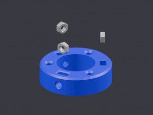
2. Prepare **M3x10** mounting bolts. Put grover first and then spacer
   * 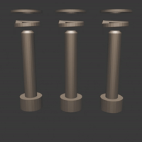
3. Preload prepared **M3x10** bolts into **Mounting Ring**
   * NOTE! They should not protrude!
   * 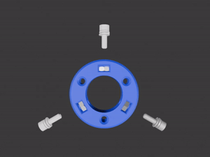
4. Put **Mounting Ring** into **Front End Disk**
   * 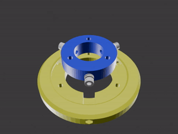
5. Preload **M3x20** bolts into **Front End Disk** 
   * NOTE! They should only sligtly protrude from the other side!
   * 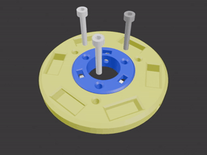
6. Preload **M3 nuts** into **Front End Base**
   * 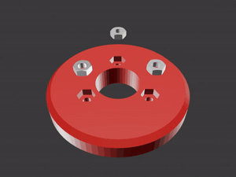
7. Put **Front End Base** on **Front End Disk**
   * 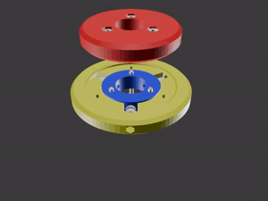
8. Now time to tighten the bolts!
    *  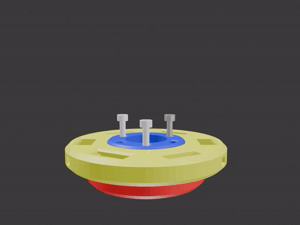

## Rear End assembly
1. Preload nuts into **Rear End**
   * 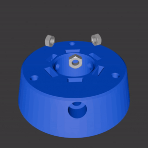
2. Prepare **M3x16** mounting bolts. Put grover first and then spacer
   * 
3. Preload **M3x16** bolts into **Rear End** 
   * NOTE! They should not protrude!
   * 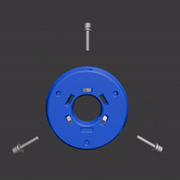

## Let's join parts together!
1. Now it's time to attach **Beams** to the **Front End Disk**.
   * Note the squere holes on the end with one fin should look inside!
   * 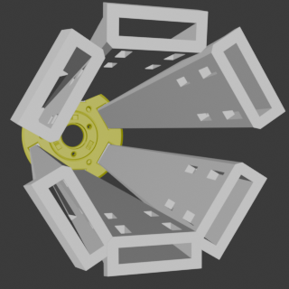
   * 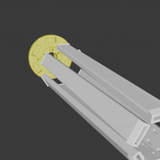

## Step 4
1. Now let's attach the other end of the **Beams** to the **Rear End**
   * 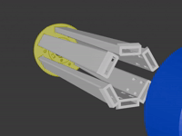

## Step 5
1. Now it's time to put complete assembly on the aluminium tube.
   * 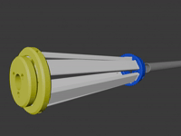

## Step 6
1. Don't forget to tighten now the assembled part on the tube by screwing screws fully on the
   1. **Rear End**
   2. **Front End Mounting Ring** through the holes in the **Front End Disk**

## Final
Good job! It's done!
Now repeat the same steps for the other end of the staff and enjoy the flow!
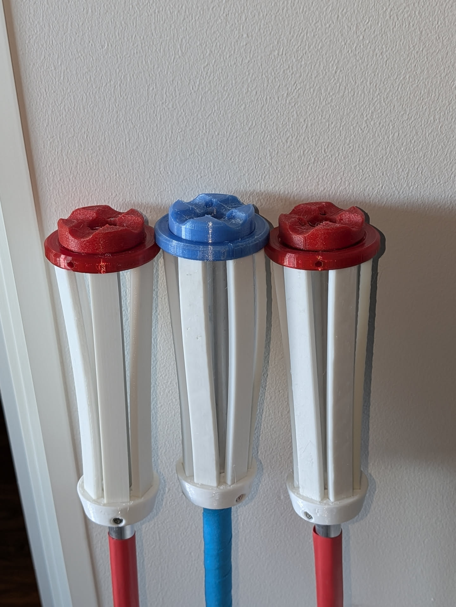
