# Bill of materials
## Hardware
| Part         | Quantity  |
|--------------|----------:|
| BHCS M3x12mm |     3     |
| SHCS M3x16mm |     3     |
| SHCS M3x10mm |     3     |

You'll need an Aluminium or Carbon tube as well if you make it from the scratch
Try to find one with thicker walls, 1-1.5mm thick walls bend quite easily
At least 2mm are required to be able to take some hits
Currently supported tubes are with 18mm and 20mm outer diameters

## 3d printed parts
### 20mm base tube diameter
| Part           | Material  | Quantity  | Link   |
|----------------|:---------:|:---------:|-------:|
| Front end base |    PLA    |    2      |        |
| Back end       |    PLA    |    2      |        |
| Front end disk |    TPU    |    2      |        |
| Beam           |    TPU    |    6(12)  |        |

### 18mm base tube diameter
| Part           | Material  | Quantity  | Link   |
|----------------|:---------:|:---------:|-------:|
| Front end base |    PLA    |    2      |        |
| Back end       |    PLA    |    2      |        |
| Front end disk |    TPU    |    2      |        |
| Beam           |    TPU    |    6(12)  |        |

# Assembly instructions
## Preparation
* Check the following image to verify that you have all needed parts 
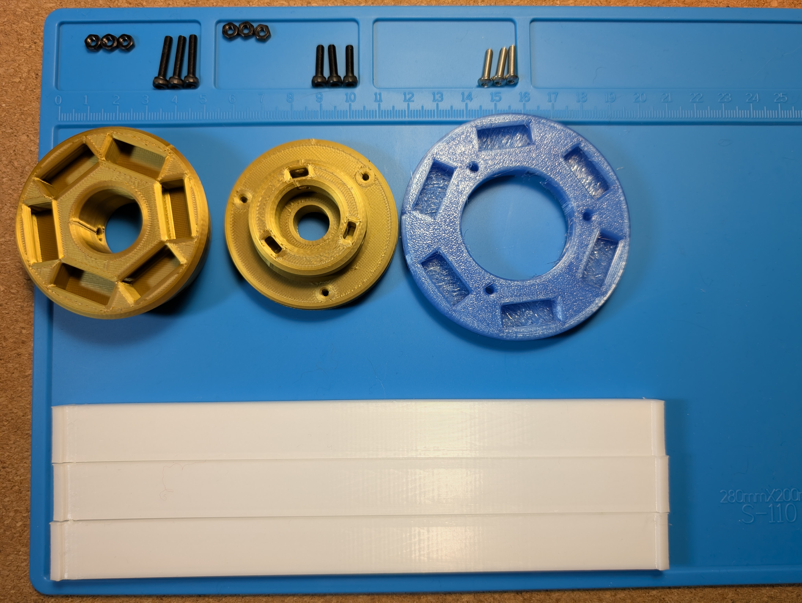
* Preload nuts into **Front end** base and **Back end** parts, note the correct positioning on the picture below:
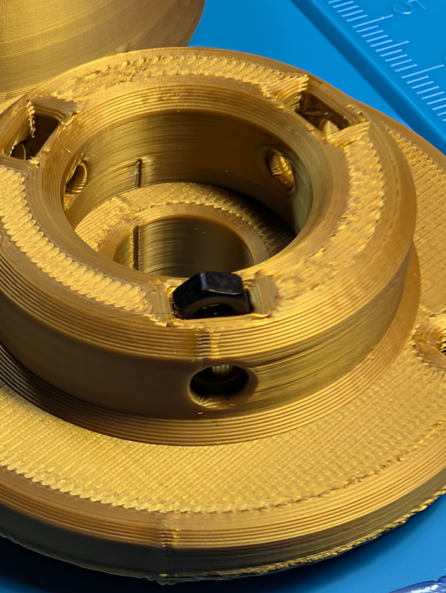
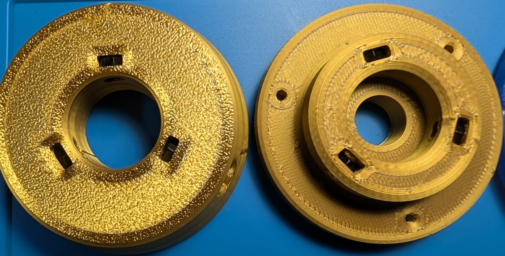
* You can prescrew screws as well now, for nuts not to fall off during assembly process
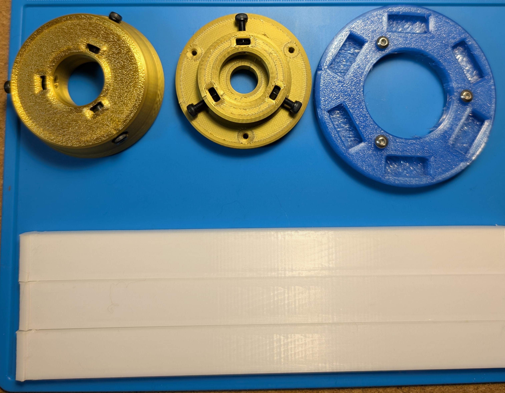

## Step 1
1. Put **Back end** part on tube
1. Put **Front end disk** on tube
NOTE! The square cuts should be oriented **inside the assembly**
1. Put **Front end base** on tube

The end result should look like this:
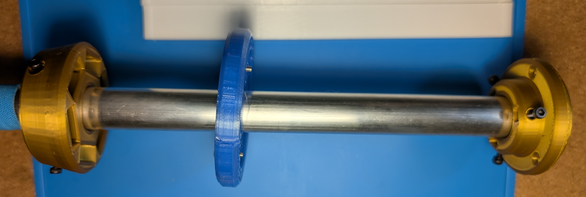

## Step 2
1. Fix the **Front end base** to the tube by tightening screws. First screw them until they engage with the tube. Then go around and do little adjustments to make it sit firmly and be centered correctly
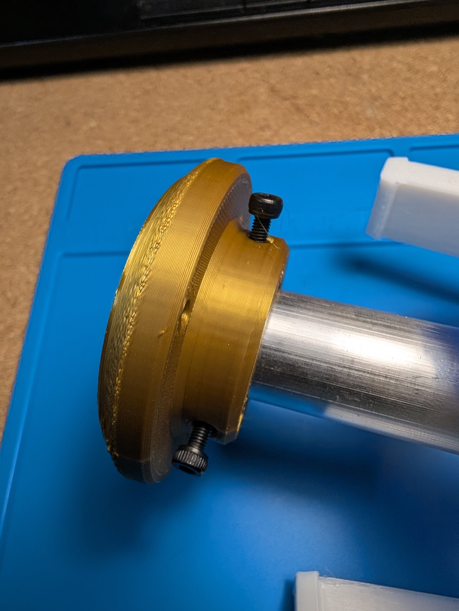

## Step 3
1. Now it's time to attach **Beams** to the **Back end**
2. Use the **Beam** end with one hook. The holes should be oriented inside the assembly
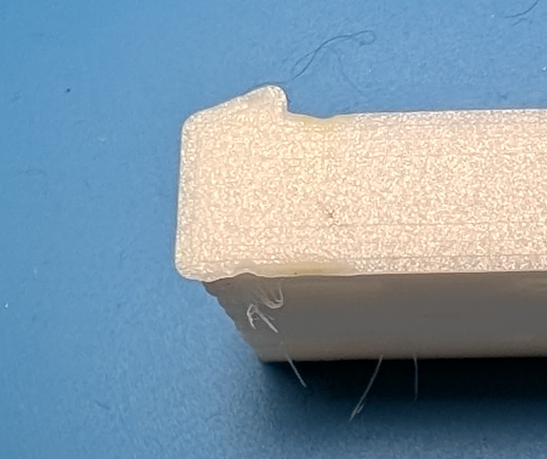
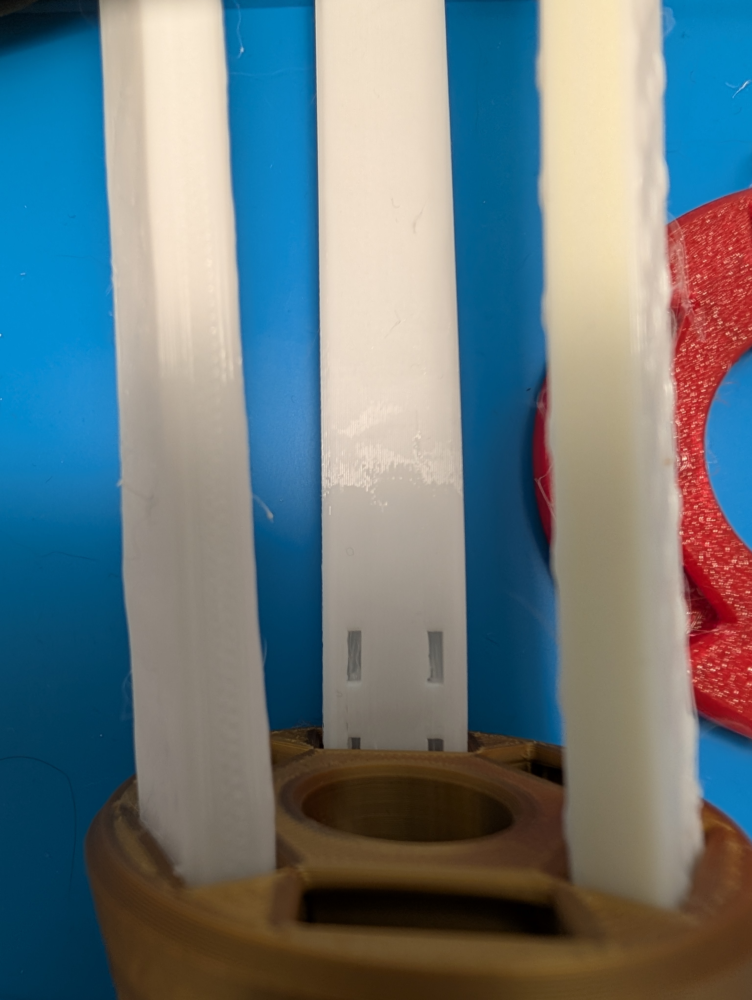

## Step 4
1. Now let's attach the other end of the **Beams** (with 2 hooks) to the **Front end disk**
2. And Now you can attach **Front end disk** using screws to the **Front end base**
NOTE! Don't overtighten, the thread is 3d printed and self tapped in the plastic, so could be easily ruined.
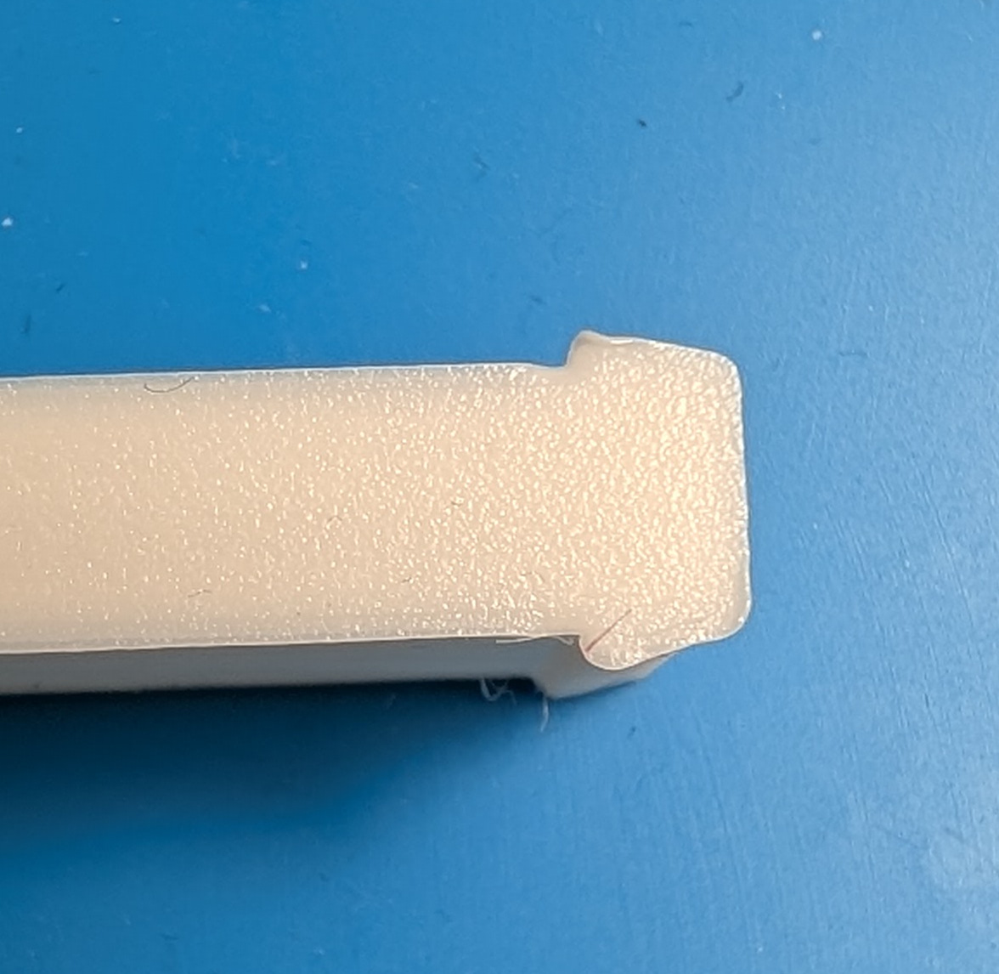
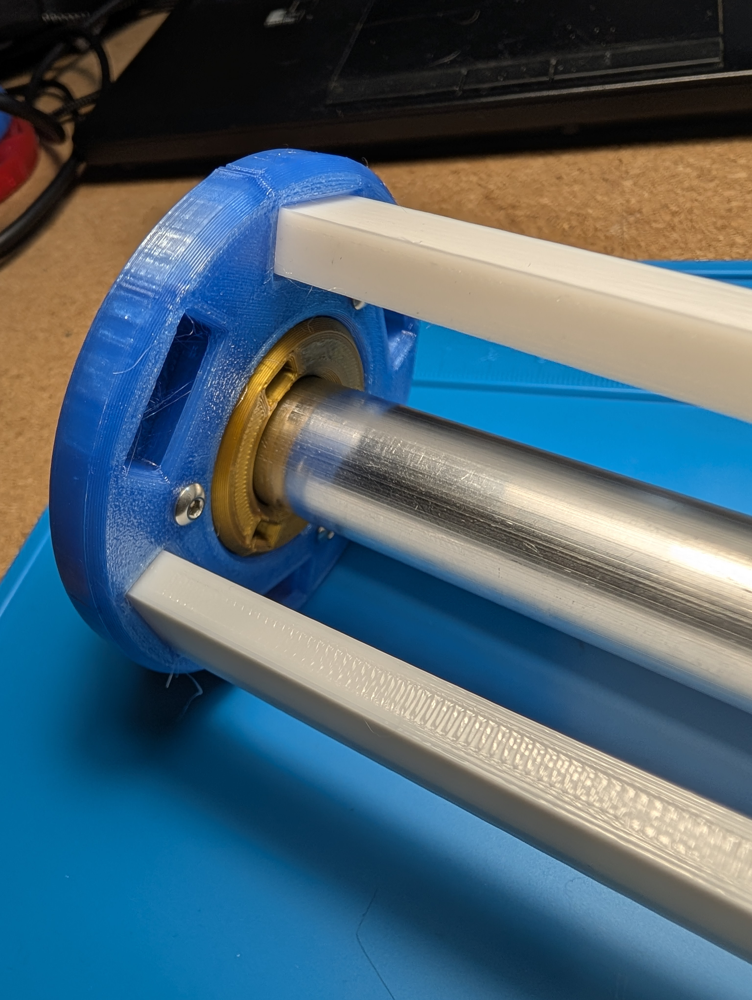

## Step 5
1. Now it's time to fix the **Back end** part on the tube, same way we did in **Step 2**
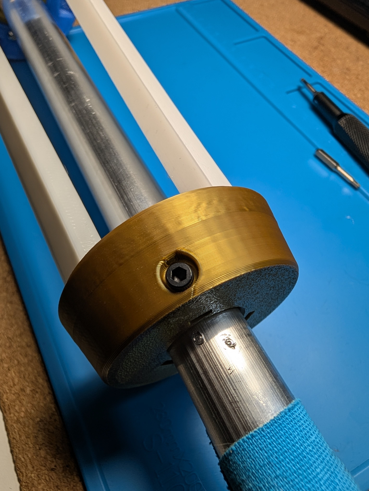

## Final
Good job! It's done!
Now repeat the same steps for the other end of the staff and enjoy the flow!
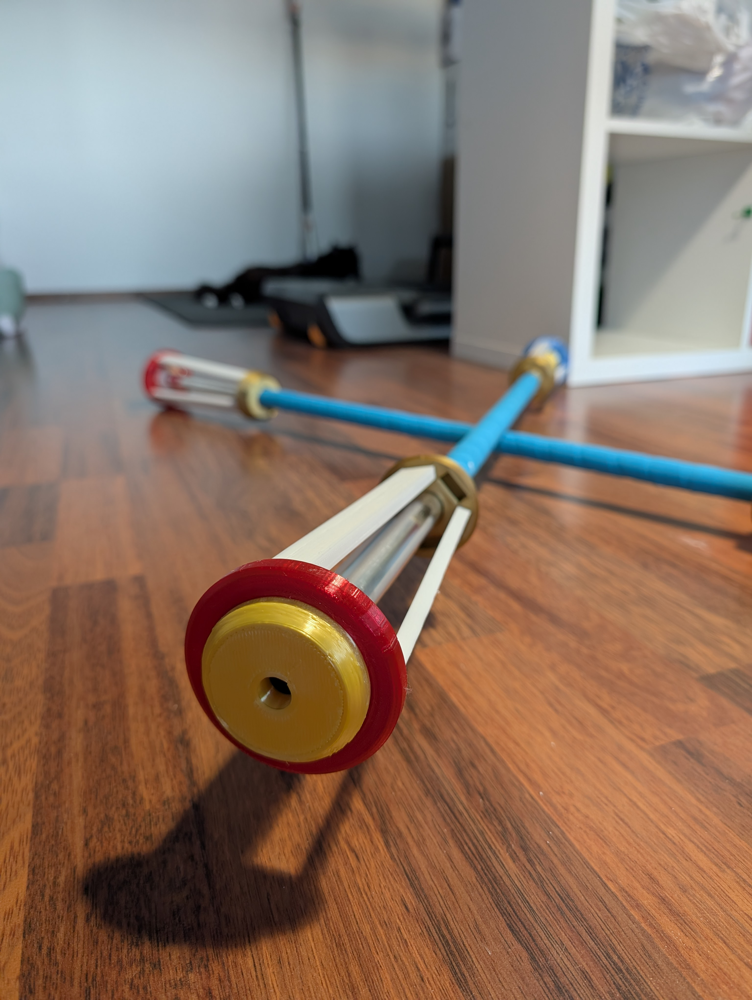
